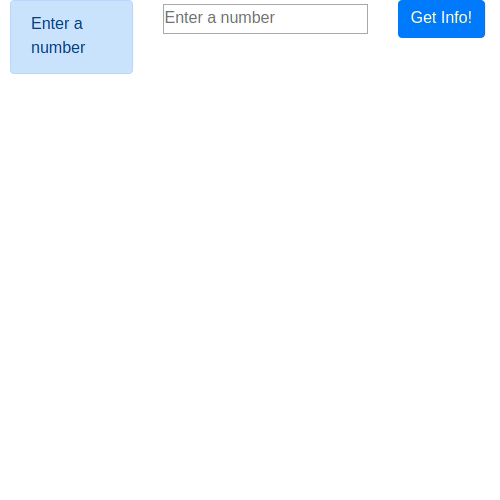

# JavaScript Promises

## Task

1. Create a new directory **exercise3**.

2. Create a proper directory structure (css for CSS files, js for JavaScript, static for HTML).

3. Create a page with a *text input* field and a *button*. When the button is clicked, read a number from the field and generate page content based on the data received from [Numbers API](http://numbersapi.com/).

4. You should include information about the **3** (three) numbers: the one entered by the user (*n*), one less than that (*n-1*), and one greater than that (*n+1*).

5. Use JavaScript Promises to send requests and parse the JSON response to generate HTML content.

6. Use Bootstrap and/or CSS to style your application.

## Demo

## References

* [JavaScript Promises: an Introduction  |  Web Fundamentals  |  Google Developers](https://developers.google.com/web/fundamentals/primers/promises)
* [Promise - JavaScript | MDN](https://developer.mozilla.org/en-US/docs/Web/JavaScript/Reference/Global_Objects/Promise)
* [Using Fetch - Web APIs | MDN](https://developer.mozilla.org/en-US/docs/Web/API/Fetch_API/Using_Fetch)
* [Promise](https://javascript.info/promise-basics)
* [Master the JavaScript Interview: What is a Promise?](https://medium.com/javascript-scene/master-the-javascript-interview-what-is-a-promise-27fc71e77261)
* [Understanding promises in JavaScript – Hacker Noon](https://hackernoon.com/understanding-promises-in-javascript-13d99df067c1)
* [asynchronous - How to wait for a JavaScript Promise to resolve before resuming function? - Stack Overflow](https://stackoverflow.com/questions/28921127/how-to-wait-for-a-javascript-promise-to-resolve-before-resuming-function)
